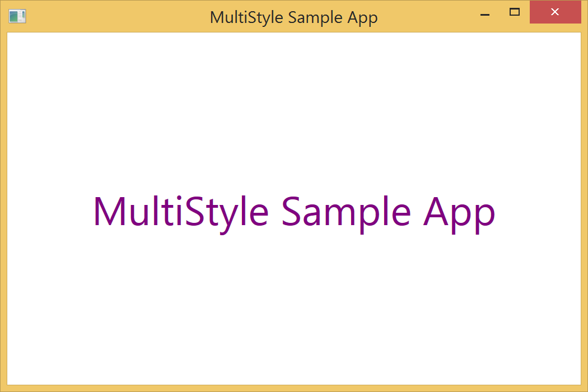

SpicyTaco.MultiStyle
==================

Compose your WPF styles just like in CSS.

[My source of inspiration](http://web.archive.org/web/20101125040337/http://bea.stollnitz.com/blog/?p=384)

Usage Examples
--------------

Given a set of styles such as these

```XML
<Style x:Key="BigText" TargetType="TextBlock">
    <Setter Property="FontSize" Value="36"/>
</Style>
<Style x:Key="CenteredText" TargetType="TextBlock">
    <Setter Property="VerticalAlignment" Value="Center"/>
    <Setter Property="HorizontalAlignment" Value="Center"/>
</Style>
<Style x:Key="GreenText" TargetType="TextBlock">
    <Setter Property="Foreground" Value="Green"/>
</Style>
<Style x:Key="PurpleText" TargetType="TextBlock">
    <Setter Property="Foreground" Value="Purple"/>
</Style>
```

You can combine these styles into a merged style and set it to a control like so

```XML
<TextBlock Text="MultiStyle Sample App" 
           st:Multi.Styles="BigText CenteredText GreenText PurpleText"/>
```

This results in

<br/>

Credits
-------

<br/>
[Furious designed by Matt Brooks from the Noun Project](http://thenounproject.com/Mattebrooks/icon/61620/)
